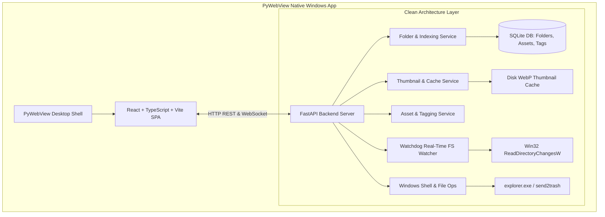

# AssetVault - Architecture & Design System

This document outlines the Clean Architecture guidelines, desktop application runtime, and package structure of the AssetVault system.

---

## 🏛️ System Architecture & Desktop Runtime

AssetVault is built as a **Standalone Windows Desktop Application** with an **In-Place Multi-Folder Reference Engine**:



---

## 🏛️ Clean Architecture Principles

To ensure separation of concerns, testability, and maintainability, the backend is organized into strictly isolated layers:

```
┌────────────────────────────────────────────────────────┐
│                        API Layer                       │
│        (Routes, HTTP Requests, FastAPI Routers)        │
└───────────────────────────┬────────────────────────────┘
                            ▼
┌────────────────────────────────────────────────────────┐
│                      Service Layer                     │
│               (Business Logic, Use Cases)              │
└───────────────────────────┬────────────────────────────┘
                            ▼
┌────────────────────────────────────────────────────────┐
│                    Repository Layer                    │
│             (Data Access, Database Queries)            │
└───────────────────────────┬────────────────────────────┘
                            ▼
┌────────────────────────────────────────────────────────┐
│                     Database Layer                     │
│            (SQLAlchemy Models, Connections)            │
└────────────────────────────────────────────────────────┘
```

### Layer Constraints
1. **API Routers**: Extremely thin. They only parse request inputs, invoke service methods, and return typed Pydantic responses.
2. **Services**: All business logic lives here (`FolderService`, `ExplorerService`, `WatcherService`, `ThumbnailService`, `AssetService`, `TagService`). Services orchestrate repositories and external libraries (`send2trash`, `watchdog`, `Pillow`).
3. **Repositories**: Encapsulate SQLAlchemy queries (`LibraryFolderRepository`, `AssetRepository`, `TagRepository`). No raw query logic leaks into services or routes.
4. **Models & Schemas**: SQLAlchemy models (`LibraryFolder`, `Asset`, `Tag`, `AssetTag`) define persistent database entities; Pydantic schemas define typed contracts.

---

## ⚡ Concurrency & Watchdog Event Suppression

To prevent race conditions, locks, and `StaleDataError` between synchronous user requests and asynchronous Win32 filesystem events:

1. **SQLite WAL (Write-Ahead Logging) Mode**: Configured with `PRAGMA journal_mode=WAL;` and `PRAGMA busy_timeout=30000;` in `backend/app/db/session.py`. This allows concurrent reads and writes between the FastAPI thread pool and the Watchdog observer worker threads without locking.
2. **Thread-Safe Event Suppression**: `WatcherService` implements `suppress_paths()` context manager and `is_suppressed()` check using a thread-safe `threading.Lock`. During internal operations (such as batch moves, renames, and trashing in `ExplorerService`), source and target file paths are registered for suppression for 3 seconds. This prevents Watchdog handlers (`on_deleted`, `on_created`, `on_moved`) from prematurely deleting database rows before the main transaction commits.
3. **Startup Library Synchronization**: On application launch, a background task automatically scans all registered active library folders, discovering files created while the app was offline and pre-generating WebP thumbnails.

---

## 🛑 Background Process & Lifecycle Management

To prevent orphaned `python.exe` processes or zombie file watcher threads on Windows:

1. **FastAPI Lifespan Cleanup**: The FastAPI server manages the lifecycle of `WatcherService` and `ConnectionManager`. When the application context exits, `watcher_service.stop_all()` is invoked synchronously.
2. **Python `atexit` Hooks**: `atexit.register(watcher_service.stop_all)` is registered as a fallback ensuring all Win32 directory observer threads close their OS handles upon process termination.
3. **PyWebView Native Window Closed Hook**: When the desktop native window is closed (`window.events.closed`), the desktop shell triggers an orderly shutdown of the Uvicorn server thread, background worker tasks, and active observers before exiting.
4. **Safe Thread Models**: Watchdog observer and emitter threads are marked `daemon=True` so that shutdown is instantaneous without hanging during OS handle release.

---

## 📁 Repository Directory Structure

```
d:\Projects\asset-vault/
├── .agents/
│   ├── AGENTS.md                   # Workspace rules & developer constraints
│   └── RELOAD.md                   # AI Agent onboarding & quick reference
├── backend/
│   ├── app/
│   │   ├── config.py               # Configuration and Environment variables
│   │   ├── db/
│   │   │   ├── session.py          # SessionLocal, Base, and Engine setup
│   │   │   └── settings.json       # Persistent storage and library configuration
│   │   ├── models/                 # SQLAlchemy DB Models (Asset, Tag, AssetTag, LibraryFolder)
│   │   ├── repositories/           # Data access layers (AssetRepo, TagRepo, LibraryFolderRepo)
│   │   ├── routes/                 # FastAPI routes (asset, inventory, folder, explorer, thumbnail, cache, ws)
│   │   ├── schemas/                # Pydantic validation schemas
│   │   └── services/               # Core business logic services
│   └── requirements.txt            # Python backend dependencies
├── dist/
│   └── AssetVault.exe              # Standalone Windows desktop executable
├── docs/                           # GitHub Pages static website & SEO assets
│   ├── index.html                  # Landing page
│   ├── favicon.png                 # Multi-resolution favicon & app icons
│   ├── og-preview.jpg              # High-res social preview card
│   ├── robots.txt                  # Search engine crawler directives
│   └── sitemap.xml                 # XML sitemap for search indexing
├── frontend/
│   ├── src/
│   │   ├── App.tsx                 # Main React Application & SPA views
│   │   ├── index.css               # Base Tailwind stylesheets
│   │   └── main.tsx                # Client entrypoint
│   ├── package.json                # Frontend dependencies
│   └── vite.config.ts              # Vite bundle configuration
├── mds/                            # Technical & system documentation
│   ├── api.md                      # Complete REST API reference
│   ├── architecture.md             # This architecture & design system doc
│   ├── privacy_policy.md           # Privacy policy & offline assurance
│   ├── roadmap.md                  # Release roadmap & phased slice breakdown
│   └── testing_plan.md             # Testing strategy and test suite documentation
├── public/                         # Production SPA bundle served by FastAPI / PyWebView
├── storage/                        # Physical storage directory for internal vault uploads
├── tasks/
│   ├── TASKS_SUMMARY.md            # Master development task summary
│   └── archive/                    # Archived historical task logs
├── tests/                          # Automated test suite (23/23 tests passing)
│   ├── run_tests.py                # Automated Python test runner
│   ├── test_asset_service.py       # Unit tests for asset & tag logic
│   ├── test_api_routes.py          # Integration tests for core asset API routes
│   ├── test_folder_and_explorer.py # Unit tests for in-place folder & explorer actions
│   ├── test_folder_and_explorer_api.py # Integration tests for folder & explorer endpoints
│   ├── test_thumbnail_and_cache.py # Unit & API tests for thumbnails & caching
│   ├── test_watcher_service.py     # File watcher lifecycle & handler event tests
│   └── test_ws_api.py              # WebSocket live sync tests
├── version_info.txt                # Windows File Version metadata resource
├── build_desktop.py                # Automated PyInstaller desktop packager
└── desktop_app.py                  # Standalone desktop application entrypoint
```
